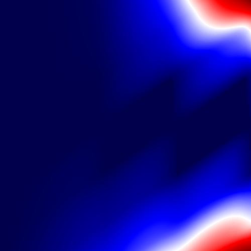

# Single Quantum Dot Simulation using the Constant Interaction Model 
Software to simulate single quantum dot systems, using the constant interaction model. Theory of model is described in [Spins in few-electron quantum dots
](https://arxiv.org/pdf/cond-mat/0610433.pdf)

To install the required environment install anaconda and run the following commands:
```conda env create -f environment.yml``` and then ```conda activate qdot-simulation```


**simulation.py** generates coulomb diamonds for randomised single quantum dot systems, and it also outputs the respective edges of each diamond. 
This code was developed to generate training data for a YOLO object localisation algorithm, which could be further utilised to perform automated read-outs of the paramters of coulomb diamonds.


The software has the following usage:
`python main.py [-help | -simulate] [<training-size>] [<validation-size>] [--noise]`

- The **-simulate** flag tells the program that you want to generate some simulations. 
    - In this case you need to pass, **<training-size>** and **<validation-size>**. These tell the program the size of
    the training set an validation set you want to produce.
    - The **--noise** flag tells the program to add noise (SHOT, Thermal and Charge) to your simulations. For no noise
    simply exclude this flag.
- You should pass the **-help** flag if you require instructions on how to use the flags.

E.g. 
```python main.py -simulate 100 20 --noise```
This generates a training set of size 100 and a validation with size 20,
with noise.

The program outputs XML files using the same formatting as the DOTA dataset. 
</br>Examples of outputted XML files are provided in the example folder. The attributes x0, y0, etc. are the four 
</br>corners of the bounding box for the diamond.   

**Visual examples of training example generated:**

<table>
   <tbody>
      <tr>
       <td>Input</td>
       <td>Output</td>
     </tr> 
     <tr>
       <td></td>
       <td></td>
     </tr > 
     <tr>
       <td></td>
       <td></td>
     </tr >      
  </tbody>
</table>


